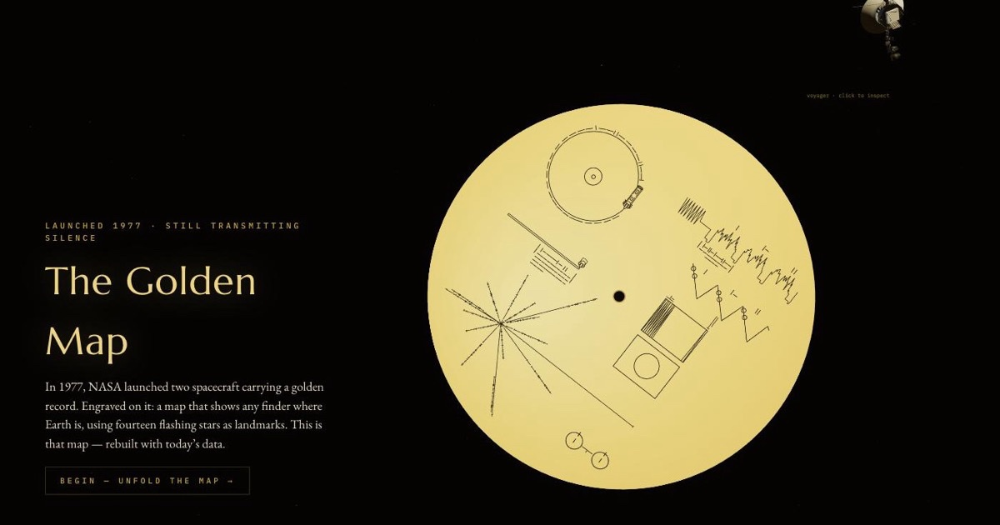

# The Golden Record: Earth's Address, Written in Dying Stars

An interactive 3D reconstruction of the pulsar map engraved on the Voyager Golden
Record — the real fourteen pulsars, with real coordinates, and an honest answer to
the question: *if someone reconstructed this map, would it actually point home?*

**Live site:** https://goldenrecord.voyage/



## Run it

A plain static site — no build step, no bundler, no framework. Serve the folder
from anywhere (GitHub Pages hosts it as-is):

```sh
python3 -m http.server 8123   # then open http://localhost:8123
```

Source lives in `js/` and `css/`; third-party code and public-domain assets
(Three.js, fonts, NASA artwork/model/texture, star catalog) in `vendor/`.
`?still=1` renders the pinned hero frame used for the social card.

## What it shows

Five acts:

1. **The Record** — the artifact itself, spinning slowly with the real cover
   design engraved as vector linework. Grab the disc to spin it; the Voyager
   probe drifts by (click it to inspect the NASA model); a small button plays
   the record's English greeting — *"Hello from the children of planet Earth."*
2. **The Map** — the pulsar-map portion of the engraving ignites, lifts off the
   disc, and unfolds 1:1 into a real 3D map of the galaxy. The side panel
   teaches the encoding: the hydrogen 21 cm hyperfine period (0.704024 ns) as
   the time unit, tick-dash binary periods, line length as distance.
3. **The Pulsars** — the master list of all 14, clickable, each blinking at a
   scaled version of its true period, with per-pulsar reference links to the
   measurements behind every number.
4. **Is It Wrong?** — the engraved 1969 geometry (warm gold) overlaid on modern
   parallax reality (cold starlight). Distances were off 2–10×; three bearings
   off 10–18°; one period was engraved with precision nobody had — yet every
   documented reconstruction still found the Sun.
5. **For the Finders** — a 100-million-year time slider: watch the beacons die
   and galactic shear tear the map apart. Plus a playable Drake equation:
   seven dials, four famous seeds (Drake 1961, Sagan, the pessimist, the
   telescope era), and N recomputed live.

A persistent mini player carries the record itself, in three collections named
on the bar rather than hidden behind an icon: *Music from Earth* (27 pieces),
*Sounds of Earth*, and *Greetings* — 55 languages, each listed in its own
script. The greetings and the Earth sounds are **self-hosted**: NASA published
them individually as public-domain files, so they are vendored here as AAC
rather than streamed from anyone.

Two spoken sections of the record are in neither of NASA's published sets, and
the player says so: the greeting from UN Secretary-General Kurt Waldheim that
opens the record, and the United Nations greetings that play under humpback
whale song. Jimmy Carter's message travelled as printed words, not sound — it is
quoted in Act V instead.

The Act I greeting button plays in **your** language where the record has one:
the visitor's browser locale is matched against the 55, falling back to the
English *"Hello from the children of planet Earth."*

## Science

Every scientific value on the page was fact-checked against primary sources
(July 2026): the ATNF Pulsar Catalogue v2.8.1, the VLBI parallax literature on
NASA ADS, Wm. Robert Johnston's line-by-line reanalysis of the map, R. Russel's
DSES reconstruction, and NASA/JPL Voyager documentation. The Act V "Sources"
panel carries the full grouped reference list, and each pulsar's card links to
its own distance measurement and live catalogue entry.

Coordinate conventions, the binary encoding, and the epoch math live in
`js/astro.js`; the dataset (with per-pulsar provenance notes) in
`js/data/pulsars.js`; the synthesized research brief in `research/brief-raw.txt`.
Module architecture is documented in `CONTRACTS.md`.

Background stars are the real sky: every star brighter than magnitude 4.5, at
its true position, from the [HYG database](https://github.com/astronexus/HYG-Database)
v3 (David Nash, astronexus.com, CC BY-SA 4.0). The spacecraft is NASA's
[Voyager 3D model](https://science.nasa.gov/resource/voyager-3d-model/) (public
domain, mesh-optimized); the Earth texture is NASA's cloud-free
[Blue Marble](https://visibleearth.nasa.gov/images/57752) (public domain); the
cover artwork is NASA/JPL (public domain, vectorization by VectorVoyager /
Wikimedia Commons).

## Credits

The record itself was made in 1977 by a committee at Cornell chaired by **Carl
Sagan**, with **Frank Drake** (technical director — he drew the pulsar map),
**Ann Druyan** (creative director), **Timothy Ferris** (producer), **Jon
Lomberg** (design), **Linda Salzman Sagan** (the spoken greetings), and
ethnomusicologists **Alan Lomax** and **Robert E. Brown**. Act V credits them in
full, along with the performers and field recordists whose work left the solar
system.

This site: prompted and art-directed by [@gourneau](https://x.com/gourneau) 🖖. Built with
[Claude Fable 5](https://www.anthropic.com/claude) (thanks, Claude) — research,
code, and fact-checking done in [Claude Code](https://claude.com/claude-code).

## Checks

    npm i && npx playwright install firefox   # once
    npm run check          # static preflight, no browser
    npm run smoke          # boots the live site in real Firefox
    npm run smoke:all      # ...and in Chromium and WebKit

Dev-only — the site itself has no dependencies and no build step. `npm run
check` resolves the import map, every relative import and every referenced
asset on disk (case-exactly), parses each module with the module goal, and
balances the CSS. `npm run smoke` asks the only question that matters: did a
frame actually render. Firefox by default, because Firefox is what once caught
an import-map ordering bug that Chrome shrugged off.

`node tools/fetch-audio.mjs` re-vendors the greetings and Earth sounds from
NASA's archived originals (macOS only — it uses `afconvert`); the converted
files are committed, so you only need it to regenerate them.
